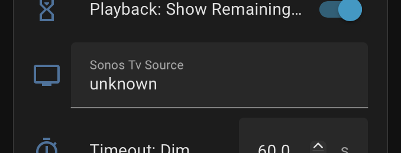

# TV Source

If your speaker has a "TV" source — for example a Sonos Playbar, Arc, or Beam in a home theater setup — the controller can show now-playing info from the TV's media player (e.g. Apple TV, Chromecast) when the speaker switches to its TV input. This feature is entirely optional and the controller works without it.

## How it works

- **Automatic switching** — when the primary media player's source becomes "TV", the UI shows title, artist, artwork, and progress from the secondary TV media player. When the source changes back, the UI reverts to the primary player.
- **Idle state** — when the TV player is idle, off, or on standby, the screen displays "TV" on a black background with playback controls hidden. Controls reappear when the TV player starts playing again.
- **Routed controls** — play/pause, next, and previous are automatically sent to whichever player is active (music or TV).

## Compatibility

This feature works with any Sonos speaker that exposes a TV source attribute in Home Assistant. The secondary media player can be any device that has a `media_player` entity in Home Assistant — Apple TV, Chromecast, Fire TV, NVIDIA Shield, etc.

## Setup

1. Open your device under **Settings → Devices & Services → ESPHome**.
2. Under **Configuration**, find the **Sonos Tv Source** field.
3. Enter the entity ID of the media player that represents the TV source device (e.g. `media_player.apple_tv`).
4. The device reboots automatically to apply the new subscription.

Leave the field empty if your speaker doesn't have a TV source or you don't want this feature — the controller works normally without it.